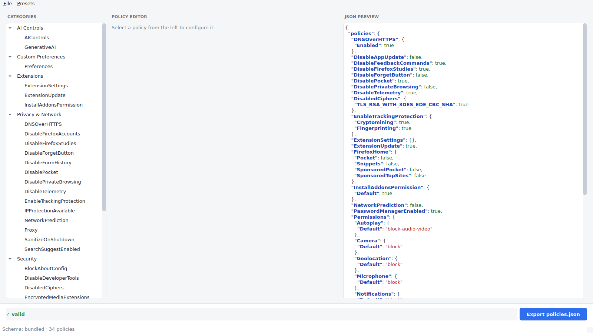
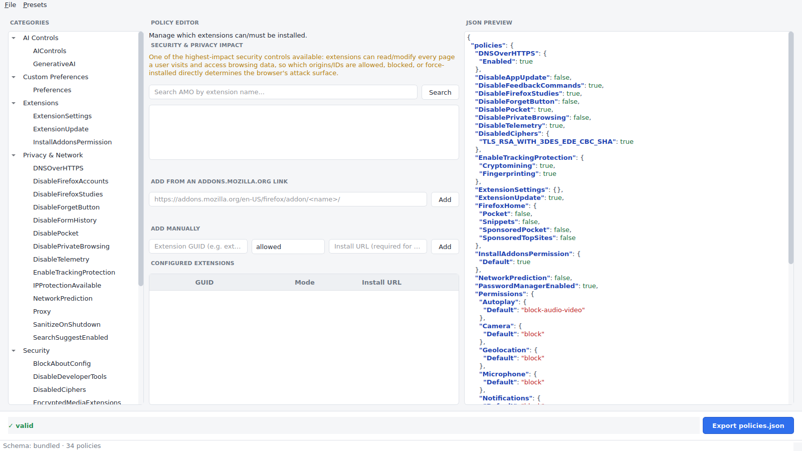
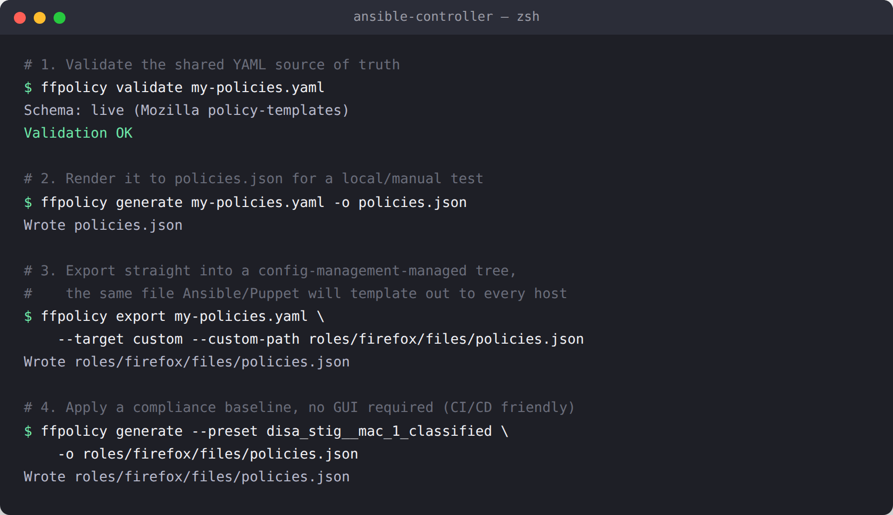

# Firefox Policy Generator

A desktop/CLI application to generate, validate, and export Firefox enterprise
`policies.json` configurations. Ships as a PySide6 GUI, a headless CLI, and a
self-contained Linux AppImage.

See [`docs/IMPLEMENTATION_PLAN.md`](docs/IMPLEMENTATION_PLAN.md) for the full design.

Read more about the project in the blog post: [Firefox Policy Generator: one source of
truth for policies.json, from your desktop to your fleet](docs/blog/firefox-policy-generator-blog-post.md).

## Screenshots

The GUI's category tree, policy editor, and live JSON preview:



The dedicated `ExtensionSettings` manager — search AMO, paste an addons.mozilla.org
listing link, or add an extension manually:



Validating, generating, and exporting a policy set from the CLI — the same commands a
playbook or manifest would run:



## Install

```bash
pip install -e ".[dev]"
```

## Usage

```bash
# GUI
python -m ffpolicy

# CLI
python -m ffpolicy validate my-policies.yaml
python -m ffpolicy generate my-policies.yaml -o policies.json
python -m ffpolicy export my-policies.yaml --target system_linux
python -m ffpolicy preview my-policies.yaml
```

### Export targets

`--target` resolves to the standard Firefox policy locations for common Linux
packaging conventions (plus `custom`, which needs `--custom-path`):

| `--target`                     | Path                                          |
| ------------------------------- | ---------------------------------------------- |
| `system_linux` (default)        | `/etc/firefox/policies/policies.json`          |
| `linux_lib64_distribution`      | `/usr/lib64/firefox/distribution/policies.json` (Fedora/RHEL) |
| `linux_lib_distribution`        | `/usr/lib/firefox/distribution/policies.json` (Debian/Ubuntu) |
| `linux_firefox_esr`             | `/usr/lib/firefox-esr/distribution/policies.json` (Debian ESR) |
| `linux_opt_distribution`        | `/opt/firefox/distribution/policies.json` (manual tarball installs) |
| `linux_snap`                     | `/etc/firefox/policies/policies.json` (Firefox snap - same file as `system_linux`; the snap's read-only install dir falls back to this path) |
| `linux_flatpak_system`           | `/var/lib/flatpak/extension/org.mozilla.firefox.systemconfig/<arch>/stable/policies/policies.json` (system-wide Flatpak Firefox) |
| `linux_flatpak_user`             | `~/.local/share/flatpak/extension/org.mozilla.firefox.systemconfig/<arch>/stable/policies/policies.json` (per-user Flatpak Firefox) |
| `distribution`                  | `distribution/policies.json` (relative to cwd) |
| `custom`                        | `--custom-path` you supply                     |

Flatpak Firefox's sandbox can't see the host's `/etc`, `/usr`, or `/opt`, so
Mozilla exposes policies through a flatpak "extension" mount point instead - a
file placed at the host path above shows up inside the sandbox as
`/app/etc/firefox/policies/policies.json`. `<arch>` is the flatpak
architecture string (e.g. `x86_64`, `aarch64`), auto-detected from the host.

Every location above except `distribution`/`custom`/`linux_flatpak_user` is
root-owned, so a plain write from an unprivileged user fails. Pass `--elevate`
to retry the write via `pkexec` (preferred - triggers a PolicyKit auth dialog)
or `sudo` (interactive terminal password prompt), whichever is found on `PATH`:

```bash
python -m ffpolicy export my-policies.yaml --target linux_lib64_distribution --elevate
```

Without `--elevate`, a permission error is reported with a hint to pass it or
choose a path you own.

### Importing an existing policies.json

If Firefox is already deployed on this machine, `discover` lists which
standard locations (the same set `export --target` writes to) currently have
a policies.json, and `import` turns one back into an editable input file:

```bash
python -m ffpolicy discover
# system_linux  ->  /etc/firefox/policies/policies.json

python -m ffpolicy import --target system_linux -o my-policies.yaml
python -m ffpolicy import /path/to/policies.json -o my-policies.yaml   # explicit path works too
```

With neither a path nor `--target`, `import` auto-detects: it succeeds only
if exactly one standard location has a policies.json, and otherwise lists the
candidates so you can pick one with `--target`. The output extension
(`.yaml`/`.yml` vs `.json`) controls the format written; `--overwrite` allows
replacing an existing output file.

Input files are YAML or JSON, either a bare `policy-name: value` mapping or a
`{firefox_version, policies}` wrapper - see `tests/fixtures/sample_input.yaml`.
Pass `--offline` to skip the live Mozilla schema sync and use the bundled fallback.

### Presets (Compliance & Privacy)

Bundled presets apply a known-good baseline in one step, then let you layer
your own settings on top. Four preset families ship by default:

**DISA STIG** — Government hardening standard (9 Mission Assurance Category profiles)
```bash
python -m ffpolicy preset-info disa_stig__mac_1_classified   # every rule's description
python -m ffpolicy generate --preset disa_stig__mac_1_classified -o policies.json
```
See [`docs/DISA_STIG.md`](docs/DISA_STIG.md) for details.

**NIST SP 800-171** — Controlled Unclassified Information (2 profiles: base + high)
```bash
python -m ffpolicy generate --preset nist_sp_800_171 -o policies.json
```
See [`docs/NIST_SP_800_171.md`](docs/NIST_SP_800_171.md) for details.

**Home User** — Balanced security/usability for individuals (Strict/Balanced/Relaxed)
```bash
python -m ffpolicy generate --preset home_user_balanced -o policies.json
```
See [`docs/HOME_USER_SECURITY.md`](docs/HOME_USER_SECURITY.md) for details.

**Home User Privacy** — Privacy-focused with credential/VPN provider choice (2 profiles)
```bash
python -m ffpolicy generate --preset home_user_privacy_accounts -o policies.json  # Firefox Accounts + Mozilla VPN
python -m ffpolicy generate --preset home_user_privacy_proton -o policies.json    # Proton Pass + Proton VPN
```
See [`docs/HOME_USER_SECURITY.md`](docs/HOME_USER_SECURITY.md#privacy-focused-presets-proton--firefox-accounts) for details.

List all presets and apply one from the GUI's Presets menu:

```bash
python -m ffpolicy presets                   # list all available presets
```

### GUI features

Beyond the build-validate-export loop (category tree → policy form → live
JSON preview → footer validation/export), the GUI's **File** menu covers the
same ground as the CLI's `export --target`/`discover`/`import`:

- **Export to standard location...** - pick any of the targets from the table
  above (or a custom path); the resolved path and whether it needs elevated
  privileges update live, with an "elevate" checkbox for the pkexec/sudo retry.
- **Import existing policies.json...** - lists policies.json files already
  found at standard locations on this machine, or browse to an explicit path;
  loads it into the current document for re-tuning and re-exporting.

Every policy's editor shows a description of what the setting does and,
where applicable, a **Security & Privacy Impact** note above the form -
e.g. `ExtensionSettings` controls the browser's biggest attack surface,
`SSLVersionMin` prevents protocol downgrade.

The Extensions category's manager offers three ways to add an extension:
search AMO by name, paste an addons.mozilla.org listing URL directly (e.g.
`https://addons.mozilla.org/en-US/firefox/addon/bitwarden-password-manager/`)
to resolve its GUID/install URL automatically, or enter the GUID/mode/install
URL by hand - the manual row is always available as a fallback if AMO is
unreachable.

## Development

```bash
make lint       # ruff + import-boundary check
make typecheck  # mypy
make test       # pytest (GUI tests run under an offscreen Qt platform)
```

## Building an AppImage

```bash
bash src/ffpolicy/packager/build_appimage.sh 0.1.0
```
